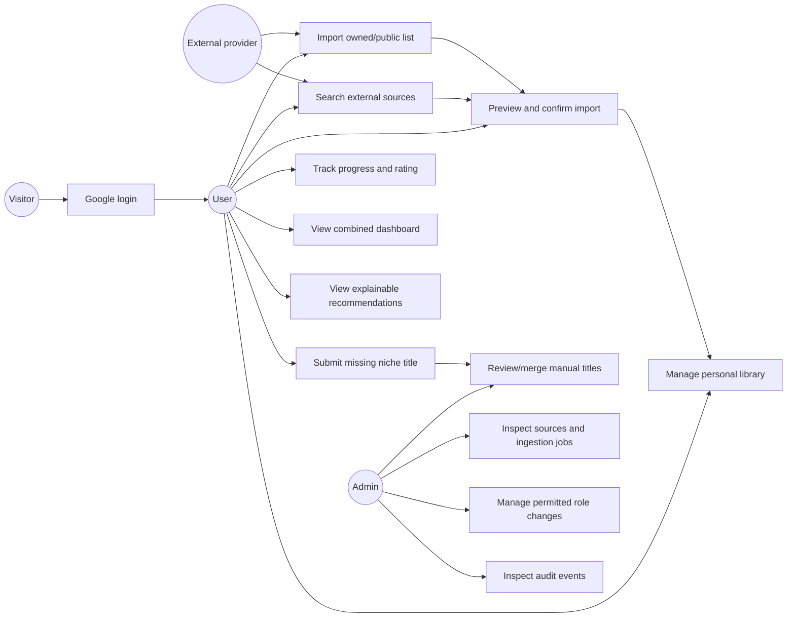
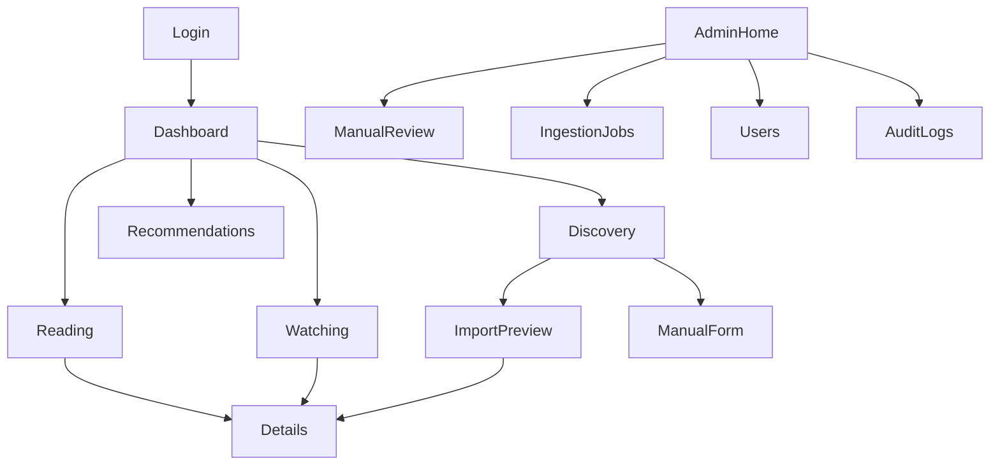

# MediaHub Requirements, Workflows, and UX Specification

**Status:** Phase 2 planning baseline complete  
**Prepared:** 5 October 2026

## Actors

| Actor | Description |
|---|---|
| Visitor | Unauthenticated person who can view the login page only |
| User | Authenticated person managing only their own library, progress, ratings, imports, and recommendations |
| Admin | Authenticated user with additional catalogue, role, ingestion, manual-review, and audit permissions |
| External provider | Approved API/export/collector supplying media or list metadata |

## Functional requirements

| ID | Requirement | Acceptance condition |
|---|---|---|
| FR-01 | Google OAuth login | A valid login creates/updates one `users` row and establishes a secure session |
| FR-02 | Logout and current user | User can retrieve their profile and terminate the session |
| FR-03 | Role-based authorization | User/admin menus, pages, and APIs enforce `USER` and `ADMIN` permissions |
| FR-04 | External discovery | Search selected providers by title and optional media type without inserting every result |
| FR-05 | Result normalization | Provider-specific responses appear in one consistent MediaHub result format |
| FR-06 | Import preview | User sees selected candidates, likely duplicates, validation warnings, and proposed actions before save |
| FR-07 | Public-list/export import | User may submit a supported authorized list URL or owned export file and monitor job status |
| FR-08 | Deduplication | Exact external mappings are reused; uncertain title/type/year matches require confirmation |
| FR-09 | Manual niche title | After no suitable result is found, a user may submit a title for admin review |
| FR-10 | Catalogue access | Users can view canonical media details and source attribution |
| FR-11 | Library CRUD | User can add, update, and remove their own library entries |
| FR-12 | Progress tracking | User can record progress appropriate to the media type and see progress history |
| FR-13 | Status/rating | User can set planned, in-progress, completed, on-hold, or dropped status and optional rating |
| FR-14 | Reading page | Books/manga support search, filters, sorting, pagination, and progress editing |
| FR-15 | Watching page | Movies/TV/anime support search, filters, sorting, pagination, and progress editing |
| FR-16 | Dashboard | User sees continue items, recent activity, counts, completion trends, top genres, and recommendation preview |
| FR-17 | Recommendations | System produces cross-media suggestions with score, model version, and explanation |
| FR-18 | Admin manual review | Admin can approve, correct, merge, or reject manually submitted media |
| FR-19 | Admin source/job view | Admin can inspect sources, failed ingestion jobs, candidate decisions, and errors |
| FR-20 | Audit trail | Security-sensitive and important catalogue/admin changes are recorded |

## Non-functional requirements

| ID | Requirement | Target |
|---|---|---|
| NFR-01 | Responsive UI | Usable at 360 px mobile width through desktop layouts |
| NFR-02 | Performance | Paginated normal API requests target p95 under 500 ms locally, excluding external-provider latency |
| NFR-03 | Provider resilience | A provider timeout/outage does not prevent access to already saved libraries |
| NFR-04 | Security | HTTP-only sessions, input validation, RBAC, ownership checks, parameterized ORM access, no committed secrets |
| NFR-05 | Data integrity | Database constraints prevent invalid status/rating/progress, duplicate mappings, and duplicate user entries |
| NFR-06 | Accessibility | Keyboard navigation, form labels, visible focus, useful alt text, and adequate contrast |
| NFR-07 | Observability | Health endpoint, structured errors, ingestion status/error recording, and audit records |
| NFR-08 | Recoverability | Documented `pg_dump` and tested `pg_restore` into a separate database |
| NFR-09 | Maintainability | Route-controller-service-repository separation and provider-adapter isolation |
| NFR-10 | Testability | Provider calls mocked; permitted scraper parsers tested using fixtures rather than repeated live calls |

## Use-case diagram



## Primary workflows

### Workflow A - External search and add

1. User opens Discovery and enters a title with optional type/provider filters.
2. Express calls applicable provider adapters in parallel with timeout and rate-limit controls.
3. Each response is normalized to `ProviderMedia`.
4. UI shows source-labelled results; search results are not inserted into the catalogue.
5. User selects one result and requests preview.
6. Server checks exact external mapping, ISBN when applicable, and title/type/year similarity.
7. Preview reports `CREATE`, `REUSE`, or `REVIEW_MATCH`.
8. User confirms the intended action and initial library status.
9. One database transaction creates/reuses canonical media, genres, mapping, library entry, and audit/progress records.
10. UI invalidates library/dashboard queries and opens the saved item.

### Workflow B - Public list/export import

1. User submits a supported public-list URL or owned CSV/JSON export.
2. Server creates an `ingestion_job` with `QUEUED` status.
3. Importer validates the source/file, changes status to `RUNNING`, and normalizes rows.
4. Candidates are stored in staging with validation and duplicate-match details.
5. Job becomes `PREVIEW_READY`; UI shows create/reuse/conflict/skipped counts.
6. User resolves conflicts and confirms.
7. Server commits confirmed candidates in batches/transactions and records failures without corrupting completed batches.
8. Job becomes `COMPLETED` with counts or `FAILED` with a safe error message.

### Workflow C - Manual niche title

1. External search returns no suitable result.
2. User chooses **No result? Add a niche title**.
3. Form requires title, media type, and at least one supporting detail/reference.
4. Server performs one more duplicate check.
5. Record is created as `MANUAL` and `PENDING_REVIEW`; user may add it to their library provisionally.
6. Admin approves, corrects, merges, or rejects it.
7. If a later provider match appears, admin attaches the external mapping to the canonical record.

### Workflow D - Progress update

1. User opens a library entry and chooses new progress.
2. Client validates basic range/type rules.
3. Server verifies authentication, ownership, media progress mode, and known total.
4. In a transaction, server updates `library_entries` and inserts `progress_events`.
5. If the final unit is reached, status becomes `COMPLETED` and `completed_at` is set.
6. Dashboard/recommendation profile is refreshed or invalidated.

### Workflow E - Admin manual review

1. Admin opens pending submissions.
2. UI shows manual metadata beside possible canonical/provider matches.
3. Admin chooses approve, edit-and-approve, merge, or reject.
4. API performs the operation transactionally and creates an audit record.
5. Affected user-library references point to the approved/merged canonical item.

## Validation and business rules

### General

- IDs must be valid UUIDs.
- Title is trimmed and 1-300 characters.
- Description and URLs have explicit maximum lengths.
- Unknown request fields are rejected for write endpoints.
- Dates must be valid ISO dates; future dates are permitted for announced works.
- URLs must use `https` unless a documented local-development exception applies.

### Library and progress

- One `(user_id, media_item_id)` library entry per user.
- Rating is optional and from 1-10.
- Progress cannot be negative.
- Progress may exceed neither known total units nor 100 for percentage mode.
- A reduction in progress is allowed but requires UI confirmation.
- `COMPLETED` sets `completed_at`; leaving completed clears it unless business rules preserve completion history in events.
- Unknown/ongoing totals allow progress but do not auto-complete.

### Import and deduplication

- Exact provider/source ID is authoritative for that source.
- ISBN is a strong book-edition identifier but works/editions must not be confused.
- Title matching uses normalized text plus media type and release year; similarity alone never silently merges an uncertain result.
- Re-importing a known title may update safe metadata/mapping timestamps but must not overwrite user progress.
- File imports enforce type/size/row limits and never execute formulas or embedded content.

### Manual submission

- Requires title, type, and one supporting field/reference.
- User cannot self-approve.
- Rejection/merge preserves an audit trail.

## Navigation map



## Low-fidelity wireframes

### Dashboard

```text
+----------------------------------------------------------------+
| MediaHub | Search | Reading | Watching | Recommendations | User |
+----------------------------------------------------------------+
| Good evening              [Discover media] [Import list]        |
| [Continue Reading --------] [Continue Watching ---------------] |
|                                                                 |
| Library totals | Completed this month | Current streak/activity |
| [Status/type chart]            [Top genres]                      |
|                                                                 |
| Recommended for you [reason shown on each card]                 |
+----------------------------------------------------------------+
```

### Discovery/import

```text
+----------------------------------------------------------------+
| Search titles [________________] [Type v] [Provider v] [Search] |
| Import a list: [URL/file________________________] [Preview]      |
+----------------------------------------------------------------+
| Source | Cover | Title | Type | Year | [Preview]                |
| TMDB   | img   | ...   | TV   | ...  | [Preview]                |
| Books  | img   | ...   | Book | ...  | [Preview]                |
+----------------------------------------------------------------+
| No suitable result? [Add a niche title]                         |
+----------------------------------------------------------------+
```

### Reading/Watching library

```text
+----------------------------------------------------------------+
| Reading: [Books] [Manga]  or  Watching: [Movies] [TV] [Anime]  |
| Search [____] Status [v] Genre [v] Sort [v]                     |
+----------------------------------------------------------------+
| Cover | Title | Status | Progress | Rating | Updated | Actions  |
|       |       |        | [---70%] | 8/10   | today   | Edit ... |
+----------------------------------------------------------------+
| < Previous                Page 1 of N                 Next >     |
+----------------------------------------------------------------+
```

### Import preview

```text
+----------------------------------------------------------------+
| Import job: PREVIEW READY | Create 12 | Reuse 8 | Conflicts 2  |
+----------------------------------------------------------------+
| Candidate | Proposed action | Match/reason        | Decision    |
| Title A   | REUSE           | same provider ID    | accepted    |
| Title B   | REVIEW_MATCH    | similar title/year  | [choose v]  |
+----------------------------------------------------------------+
| [Cancel]                              [Confirm selected import] |
+----------------------------------------------------------------+
```

## Phase 2 acceptance record

- [x] Actors and 20 functional requirements documented.
- [x] Non-functional requirements and measurable targets documented.
- [x] External search, list import, manual fallback, progress, and admin workflows defined.
- [x] Validation and edge cases defined.
- [x] Navigation, use-case diagram, and principal wireframes completed.
- [x] REST API contract completed in the companion document.

