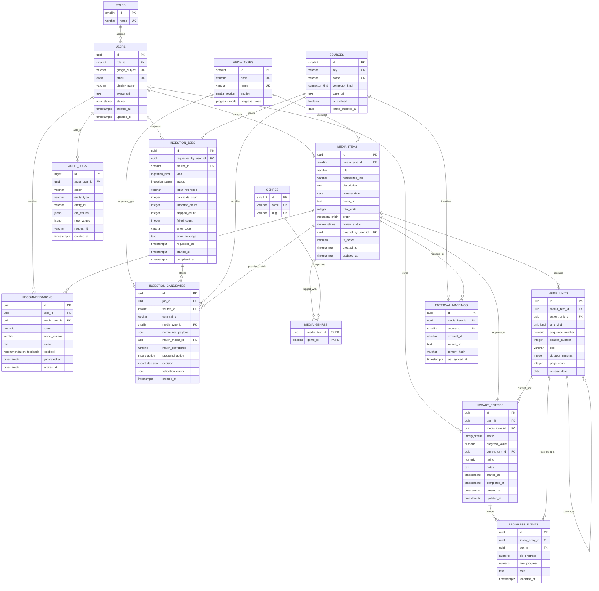

# MediaHub Database Design

**Database:** PostgreSQL  
**ORM:** Prisma  
**Status:** Schema v1 planning baseline complete  
**Prepared:** 5 October 2026

## Design goals

- Maintain one canonical record per media work while preserving provider-specific identifiers.
- Keep catalogue metadata separate from user-specific status, progress, and ratings.
- Stage imported data before it becomes canonical.
- Support different progress models without separate movie/book/anime library tables.
- Enforce integrity in PostgreSQL as well as in Express validation.
- Support the joins, aggregates, views, transactions, function/procedure, trigger, and indexes required by the project brief.

## Entity-relationship diagram



## Relationship summary

| Relationship | Cardinality | Rule |
|---|---|---|
| Role to users | 1:N | Every user has exactly one role |
| Media type to media items | 1:N | Every canonical item has exactly one type |
| Media items to genres | M:N | Implemented through `media_genres` |
| Media item to units | 1:N | Optional for episodes/chapters/volumes/editions |
| User to media items | M:N | Implemented through `library_entries` with status/progress/rating |
| Library entry to progress events | 1:N | Preserves progress history |
| Source to media item | M:N | Implemented through `external_mappings` |
| User/source to ingestion jobs | 1:N | Each import is attributable and observable |
| Ingestion job to candidates | 1:N | Temporary normalized records before confirmation |
| User/media item to recommendations | M:N over time | Stores ranked result and explanation |

## PostgreSQL enum plan

Prisma enums map to PostgreSQL enums where supported:

```text
USER_STATUS              ACTIVE, SUSPENDED
MEDIA_SECTION            READING, WATCHING
PROGRESS_MODE            PERCENTAGE, PAGE, CHAPTER, EPISODE
METADATA_ORIGIN          EXTERNAL, MANUAL
REVIEW_STATUS            APPROVED, PENDING_REVIEW, REJECTED
UNIT_KIND                SEASON, EPISODE, VOLUME, CHAPTER, EDITION
LIBRARY_STATUS           PLANNED, IN_PROGRESS, COMPLETED, ON_HOLD, DROPPED
CONNECTOR_KIND           API, EXPORT, SCRAPER
INGESTION_KIND           SELECTED_RESULTS, PUBLIC_LIST_URL, FILE_UPLOAD
INGESTION_STATUS         QUEUED, RUNNING, PREVIEW_READY, COMPLETED, FAILED, CANCELLED
IMPORT_ACTION            CREATE, REUSE, REVIEW_MATCH, SKIP
IMPORT_DECISION          UNDECIDED, CREATE, REUSE, SKIP
RECOMMENDATION_FEEDBACK  NONE, USEFUL, NOT_INTERESTED, DISMISSED
```

## Relational schema

```text
ROLES(
  id PK,
  name UQ NOT NULL
)

USERS(
  id PK,
  role_id FK -> ROLES.id NOT NULL,
  google_subject UQ NOT NULL,
  email UQ NOT NULL,
  display_name NOT NULL,
  avatar_url,
  status NOT NULL DEFAULT ACTIVE,
  created_at NOT NULL DEFAULT now(),
  updated_at NOT NULL DEFAULT now()
)

MEDIA_TYPES(
  id PK,
  code UQ NOT NULL,
  name UQ NOT NULL,
  section NOT NULL,
  progress_mode NOT NULL
)

MEDIA_ITEMS(
  id PK,
  media_type_id FK -> MEDIA_TYPES.id NOT NULL,
  title NOT NULL,
  normalized_title NOT NULL,
  description,
  release_date,
  cover_url,
  total_units CHECK total_units >= 0,
  origin NOT NULL,
  review_status NOT NULL,
  created_by_user_id FK -> USERS.id,
  is_active NOT NULL DEFAULT true,
  created_at NOT NULL DEFAULT now(),
  updated_at NOT NULL DEFAULT now()
)

GENRES(id PK, name UQ NOT NULL, slug UQ NOT NULL)

MEDIA_GENRES(
  media_item_id PK/FK -> MEDIA_ITEMS.id,
  genre_id PK/FK -> GENRES.id
)

MEDIA_UNITS(
  id PK,
  media_item_id FK -> MEDIA_ITEMS.id NOT NULL,
  parent_unit_id FK -> MEDIA_UNITS.id,
  unit_kind NOT NULL,
  sequence_number NOT NULL CHECK sequence_number >= 0,
  season_number CHECK season_number >= 0,
  title,
  duration_minutes CHECK duration_minutes > 0,
  page_count CHECK page_count > 0,
  release_date,
  UQ(media_item_id, unit_kind, sequence_number)
)

LIBRARY_ENTRIES(
  id PK,
  user_id FK -> USERS.id NOT NULL,
  media_item_id FK -> MEDIA_ITEMS.id NOT NULL,
  status NOT NULL DEFAULT PLANNED,
  progress_value NOT NULL DEFAULT 0 CHECK progress_value >= 0,
  current_unit_id FK -> MEDIA_UNITS.id,
  rating CHECK rating BETWEEN 1 AND 10,
  notes,
  started_at,
  completed_at,
  created_at NOT NULL DEFAULT now(),
  updated_at NOT NULL DEFAULT now(),
  UQ(user_id, media_item_id)
)

PROGRESS_EVENTS(
  id PK,
  library_entry_id FK -> LIBRARY_ENTRIES.id NOT NULL,
  unit_id FK -> MEDIA_UNITS.id,
  old_progress CHECK old_progress >= 0,
  new_progress NOT NULL CHECK new_progress >= 0,
  note,
  recorded_at NOT NULL DEFAULT now()
)

SOURCES(
  id PK,
  key UQ NOT NULL,
  name UQ NOT NULL,
  connector_kind NOT NULL,
  base_url NOT NULL,
  is_enabled NOT NULL DEFAULT true,
  terms_checked_at NOT NULL
)

EXTERNAL_MAPPINGS(
  id PK,
  media_item_id FK -> MEDIA_ITEMS.id NOT NULL,
  source_id FK -> SOURCES.id NOT NULL,
  external_id NOT NULL,
  source_url NOT NULL,
  content_hash,
  last_synced_at NOT NULL DEFAULT now(),
  UQ(source_id, external_id)
)

INGESTION_JOBS(
  id PK,
  requested_by_user_id FK -> USERS.id NOT NULL,
  source_id FK -> SOURCES.id,
  kind NOT NULL,
  status NOT NULL DEFAULT QUEUED,
  input_reference,
  candidate_count NOT NULL DEFAULT 0 CHECK candidate_count >= 0,
  imported_count NOT NULL DEFAULT 0 CHECK imported_count >= 0,
  skipped_count NOT NULL DEFAULT 0 CHECK skipped_count >= 0,
  failed_count NOT NULL DEFAULT 0 CHECK failed_count >= 0,
  error_code,
  error_message,
  requested_at NOT NULL DEFAULT now(),
  started_at,
  completed_at
)

INGESTION_CANDIDATES(
  id PK,
  job_id FK -> INGESTION_JOBS.id NOT NULL,
  source_id FK -> SOURCES.id NOT NULL,
  external_id NOT NULL,
  media_type_id FK -> MEDIA_TYPES.id NOT NULL,
  normalized_payload JSONB NOT NULL,
  match_media_id FK -> MEDIA_ITEMS.id,
  match_confidence CHECK match_confidence BETWEEN 0 AND 1,
  proposed_action NOT NULL,
  decision NOT NULL DEFAULT UNDECIDED,
  validation_errors JSONB NOT NULL DEFAULT '[]',
  created_at NOT NULL DEFAULT now(),
  UQ(job_id, source_id, external_id)
)

RECOMMENDATIONS(
  id PK,
  user_id FK -> USERS.id NOT NULL,
  media_item_id FK -> MEDIA_ITEMS.id NOT NULL,
  score NOT NULL CHECK score BETWEEN 0 AND 1,
  model_version NOT NULL,
  reason NOT NULL,
  feedback NOT NULL DEFAULT NONE,
  generated_at NOT NULL DEFAULT now(),
  expires_at,
  UQ(user_id, media_item_id, model_version, generated_at)
)

AUDIT_LOGS(
  id PK,
  actor_user_id FK -> USERS.id,
  action NOT NULL,
  entity_type NOT NULL,
  entity_id NOT NULL,
  old_values JSONB,
  new_values JSONB,
  request_id,
  created_at NOT NULL DEFAULT now()
)
```

## Normalization proof

### First Normal Form

- Each column holds one value; genres are rows in `genres`/`media_genres`, not comma-separated text.
- Episodes, chapters, volumes, and editions are rows in `media_units`, not repeating columns.
- Provider mappings and progress history are separate rows.

### Second Normal Form

- The only planned composite primary key is `media_genres(media_item_id, genre_id)` and it has no non-key attributes.
- Other tables use surrogate keys; their non-key columns depend on the complete row identity.

### Third Normal Form

- Role name depends on `roles.id`, not `users.id`, so it is not repeated in users.
- Type name, section, and progress mode depend on `media_types.id`, not each media item.
- Genre name/slug depend on `genres.id`, not media items.
- Source name/base URL/connector type depend on `sources.id`; mappings store only the FK and source-specific ID.
- User progress/rating depends on `(user_id, media_item_id)` and is separated from canonical metadata.
- Import-job facts are separated from candidate facts.
- Recommendation score/reason depends on a user, candidate item, model version, and generation event, not on the media record alone.

The v1 design is therefore in 3NF. JSONB is limited to external normalized staging payloads, validation details, and audit snapshots where fields are transient or intentionally schemaless; core relational facts remain normalized columns/tables.

## Delete/update rules

| Relationship | Rule |
|---|---|
| Roles -> users | `RESTRICT`; a role in use cannot be deleted |
| Users -> library entries | Application soft-deactivation preferred; hard-delete policy must explicitly cascade/anonymize personal data |
| Media items -> library entries | `RESTRICT`; use `is_active=false` rather than deleting referenced history |
| Media items -> genres/units/mappings | `CASCADE` only if an unreferenced media item is explicitly hard-deleted |
| Library entries -> progress events | `CASCADE` if user explicitly deletes the entry under the retention policy |
| Sources -> mappings/jobs/candidates | `RESTRICT`; disable the source instead of deleting it |
| Ingestion jobs -> candidates | `CASCADE` when expired staging data is purged |
| Users/media -> recommendations | `CASCADE` for user deletion; media normally soft-deleted |
| Users -> audit logs | `SET NULL` to retain the audit event if personal data is removed |

## Index plan

| Index | Supports |
|---|---|
| Unique `users(email)` and `users(google_subject)` | Login/account lookup |
| `media_items(media_type_id, normalized_title)` | Type-filtered catalogue search |
| Optional PostgreSQL trigram index on `media_items.normalized_title` | Fuzzy title/deduplication search |
| Unique `library_entries(user_id, media_item_id)` | Duplicate prevention |
| `library_entries(user_id, status, updated_at DESC)` | Dashboard and filtered library |
| `progress_events(library_entry_id, recorded_at DESC)` | Progress history |
| Unique `external_mappings(source_id, external_id)` | Exact provider deduplication |
| `external_mappings(media_item_id)` | Source attribution/detail page |
| `ingestion_jobs(requested_by_user_id, status, requested_at DESC)` | User import history |
| `ingestion_jobs(status, requested_at)` | Worker/admin queue |
| `ingestion_candidates(job_id, decision)` | Preview/confirmation pages |
| `ingestion_candidates(match_media_id)` | Conflict/merge inspection |
| `recommendations(user_id, score DESC)` with active expiry filter where practical | Ranked recommendation page |
| `audit_logs(entity_type, entity_id, created_at DESC)` | Entity audit history |

Indexes will be validated with `EXPLAIN ANALYZE`; redundant indexes will not be retained merely to increase the count.

## Planned database objects

### Views

1. `user_library_summary` - user/type/status counts, average rating, and last update.
2. `media_popularity_summary` - number of libraries, completions, and average rating per media item.

### Function/procedure

`get_user_genre_profile(p_user_id UUID)` returns genre ID/name, weighted preference score, and contributing-title count. Completed/high-rated entries receive more weight; dropped/low-rated entries receive reduced or negative weight.

### Triggers

1. `set_updated_at` updates `updated_at` consistently on mutable tables.
2. `audit_media_item_change` writes admin/manual-review catalogue changes to `audit_logs`.
3. Progress completion may be implemented by a trigger or, preferably, by the transactional service plus database checks; at least one business trigger will be demonstrated.

## Required transactions

1. **Import confirmation:** create/reuse media, upsert genres/mappings, add library entry, update candidate/job counts.
2. **Progress update:** lock/validate entry, update progress/status/dates, insert progress event.
3. **Manual-title merge:** repoint safe relationships, resolve duplicate user entries, transfer mappings/genres, deactivate source record, audit.
4. **Role change:** prevent removal of the last admin and write audit event.

## Phase 3 acceptance record

- [x] Fifteen tables defined; every table is represented in the ER diagram.
- [x] More than four primary entities and three relationships are present.
- [x] Primary keys, foreign keys, cardinalities, nullability, defaults, checks, and unique constraints are planned.
- [x] Relational schema and data dictionary are complete.
- [x] 1NF, 2NF, and 3NF are justified.
- [x] Delete/update behavior and index plan are documented.
- [x] Views, function/procedure, triggers, joins/aggregates, and transaction cases are planned.

